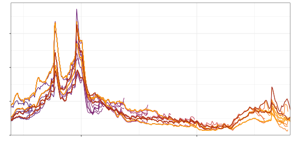
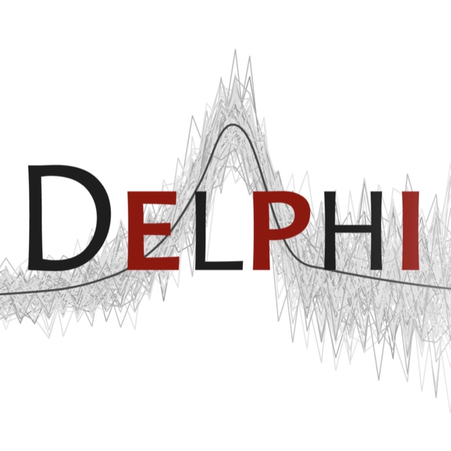

::: {.grid}

::: {.g-col-12 .g-col-lg-6 .px-5}

{fig-align="center"}

::: {layout-ncol=4}

:::

:::

::: {.g-col-12 .g-col-lg-6 .px-5}

## Mini-Projects

In this workshop, we will explore Delphi's tooling for epidemiological data analysis. These interactive activities naturally build on each other, covering data fetching, exploratory analysis, and forecasting.

1. [Mini-Project 1: Finding indicators and fetching data](scripts/miniproject_1_solutions.qmd)
2. [Mini-Project 2: EDA and correlation analysis](scripts/miniproject_2_solutions.qmd)
3. [Mini-Project 3: Forecasting with `epipredict`](scripts/miniproject_3_solutions.qmd)

## Instructors

* Logan C. Brooks
* Nolan Gormley

:::

:::
